<div align="center">


<h3 style="font-size: 30px"> Mixtapes </h3>

A modern, Linux-first YouTube Music player built with GTK4 and Libadwaita.
<br><small>formerly known as Muse</small>

</div>

[](LICENSE)
[](https://github.com/m-obeid/Mixtapes/stargazers)
[](https://github.com/m-obeid/Mixtapes/issues)
[](https://aur.archlinux.org/packages/mixtapes-git)
[](https://github.com/m-obeid/Mixtapes/actions/workflows/build-flatpak.yml)
[](https://github.com/m-obeid/Mixtapes/actions/workflows/build-windows.yml)
[](https://nightly.link/m-obeid/Mixtapes/workflows/build-windows/main/mixtapes-windows-x86_64-setup.zip)

> [!NOTE]
> This software is in alpha. Expect bugs and missing features.
> It is not affiliated with, funded, authorized, endorsed, or in any way associated with YouTube, Google LLC or any of their affiliates and subsidiaries.
> Help is always appreciated through donations or contributions - feel free to open an issue or a pull request!

<br>

[](https://ko-fi.com/M8P12091FB)
[](https://github.com/sponsors/m-obeid/)

<br clear="both"/>

---

<div align="center">
  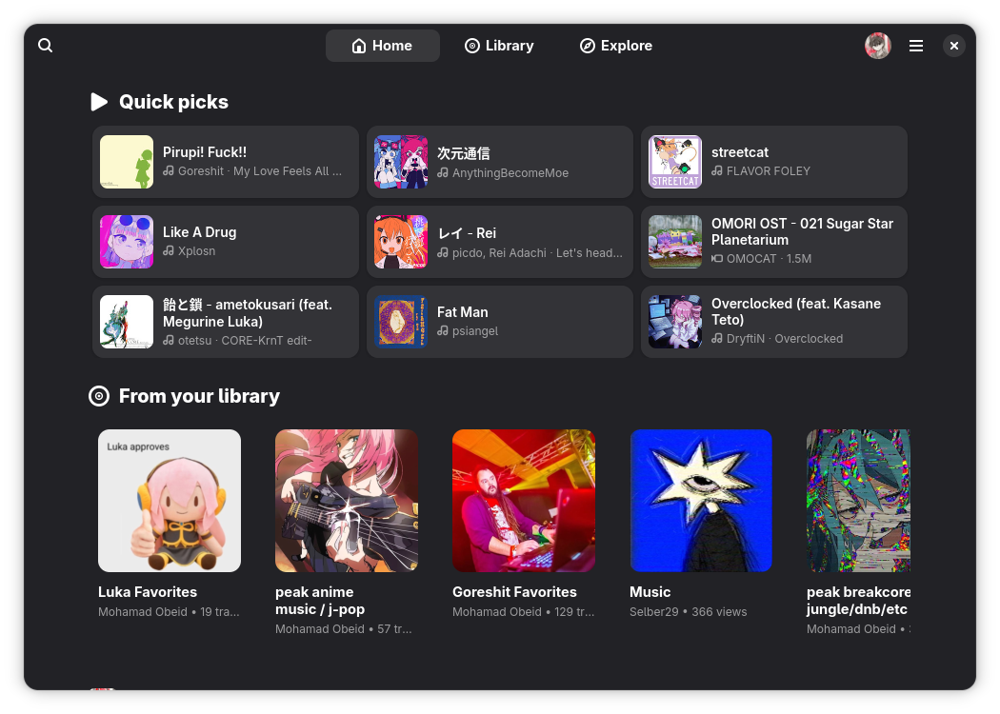
  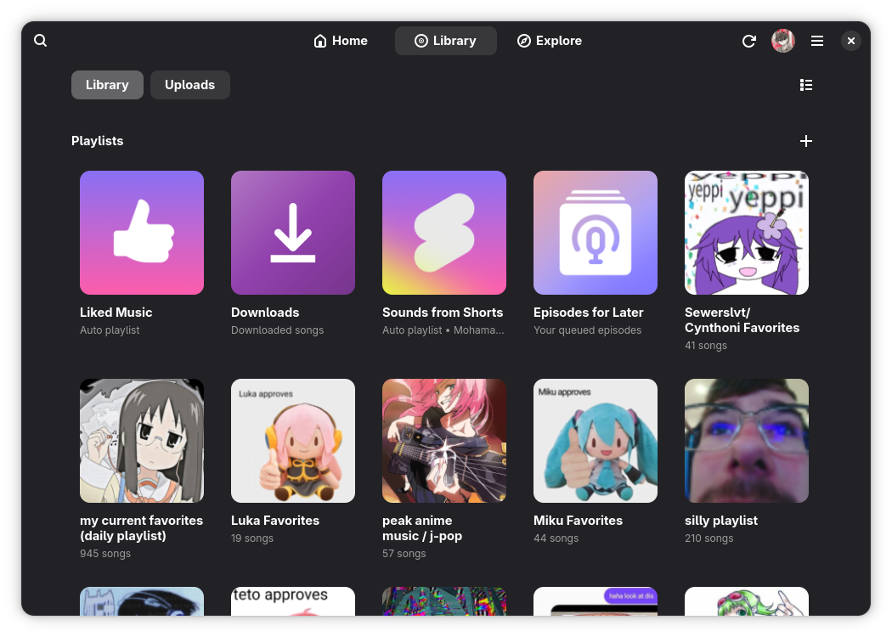 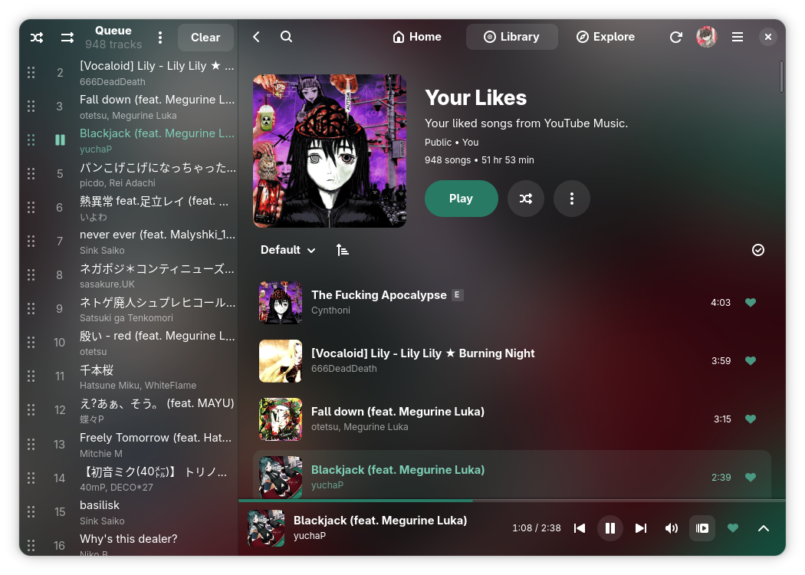
  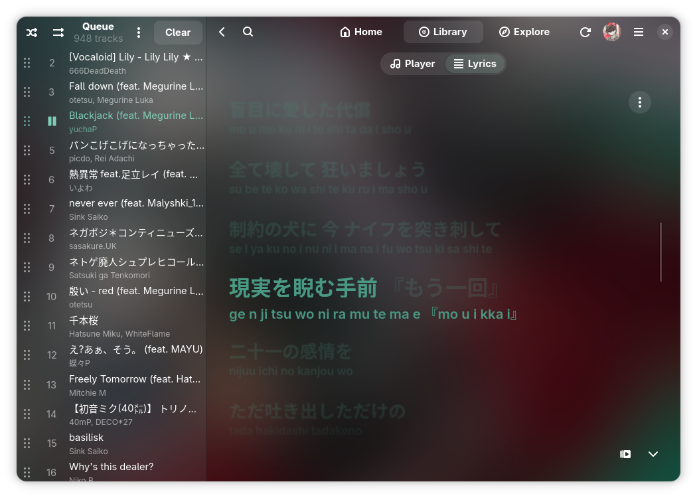 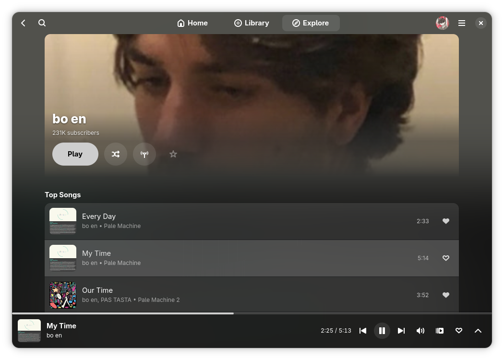
  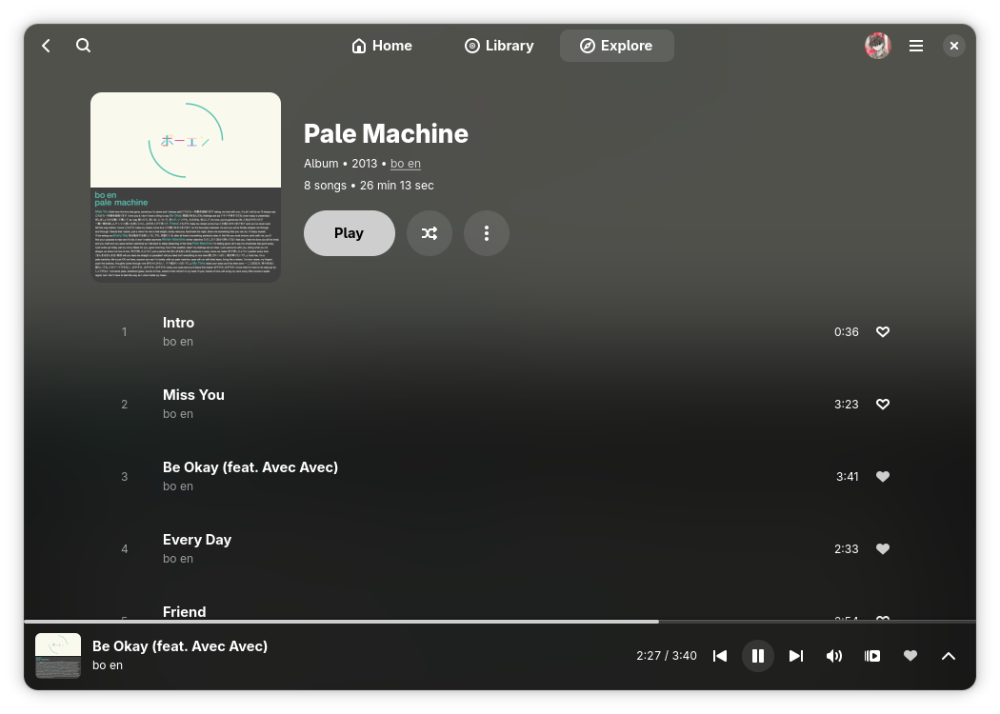 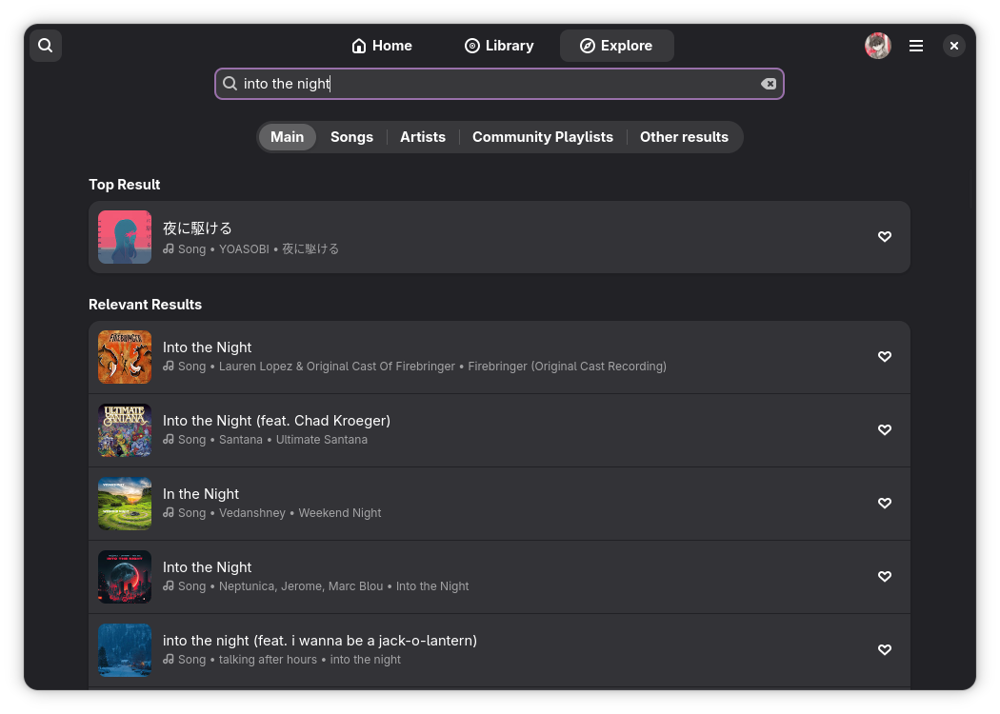
  <br/>
  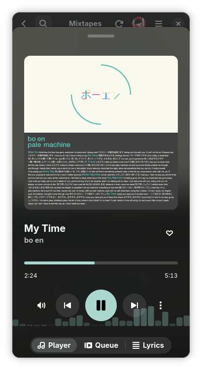 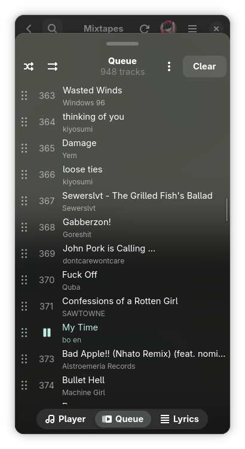 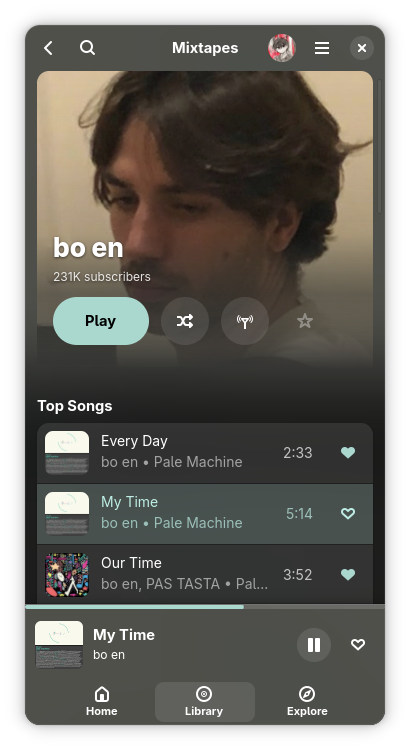 
  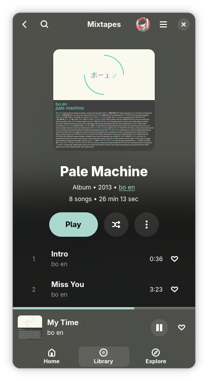
</div>

---

## Table of Contents

- [Features](#features)
- [Installation](#installation)
- [Authentication](#authentication)
- [Opening Links](#opening-links)
- [Roadmap](#roadmap)
- [Contributing](#contributing)
- [Star History](#star-history)
- [Contributors](#contributors)
- [License](#license)

## Features

- **YouTube Music Integration** - Connect with your account and access your full library
- **Library Access** - Playlists, liked songs, artists, albums, and uploads
- **Search & Discovery** - New releases, moods & moments, genres, trending, and charts
- **Full Playback Control** - Play/pause, seeking, queue management, shuffle, repeat modes
- **Downloads** - Download tracks for offline playback as local files
- **Scrobbling** - Submit your plays to Last.fm and ListenBrainz, with an offline backlog
- **MPRIS Support** - Control playback from system media controls (Linux)
- **Windows SMTC** - System media transport controls integration (Windows)
- **Radio & Mixes** - Start a radio station from any song or artist
- **Background Playback** - Music keeps playing when the window is closed (system tray on Windows)
- **Playlist Editing** - Reorder, multi-select edit, change covers, visibility, and metadata
- **Caching** - Cached data for snappy performance
- **Responsive UI** - Adaptive layout built with Libadwaita

## Installation

### Flatpak (Recommended)

This is the recommended way to install Mixtapes on Linux, as it avoids issues with your distribution's packaging.

Add the automated repository and install:

```bash
flatpak remote-add --user --if-not-exists mixtapes https://m-obeid.github.io/Mixtapes/mixtapes.flatpakrepo
flatpak install --user mixtapes com.pocoguy.Muse
```

> [!NOTE]
> If you previously installed under the old "Muse" repository name, remove the old remote first:
> `flatpak remote-delete --user muse`

<details>
<summary>Offline bundle install</summary>

Download the latest artifact from [GitHub Actions](https://github.com/m-obeid/Mixtapes/actions), then:

```bash
unzip Mixtapes-x86_64-flatpak.zip
flatpak install --user ./Mixtapes-x86_64.flatpak
```

Both `x86_64` and `aarch64` builds are available.

</details>

### Windows

Get the installer from the
[latest Windows build](https://nightly.link/m-obeid/Mixtapes/workflows/build-windows/main/mixtapes-windows-x86_64-setup.zip),
or the portable folder from the same CI run. The installer adds the Microsoft
Edge WebView2 Runtime, which the sign-in page needs, where Windows lacks it
(Windows 10 LTSC, for one).

### AUR (Arch Linux)

```bash
yay -S mixtapes-git
```

> [!WARNING]
> If you are using CachyOS, you will also need to reinstall webkitgtk-6.0 from the Arch 'extra' repo, not the CachyOS repo:
> `sudo pacman -S extra/webkitgtk-6.0`

### Nix

> [!WARNING]
> This is not extensively tested, if there are any issues to fix, please open a PR!

```
nix run github:m-obeid/Mixtapes       # run directly from GitHub
nix run                               # run from local checkout
nix develop                           # enter dev shell
```

### From Source

> [!NOTE]
> Mixtapes is written in Rust. The original Python app was retired once the port reached feature parity.
> [ARCHITECTURE.md](ARCHITECTURE.md) describes how it is put together.

<details>
<summary>Install dependencies for your distro</summary>

**Arch Linux:**

```bash
sudo pacman -S git rust gtk4 libadwaita webkitgtk-6.0 sqlite gstreamer gst-plugins-base gst-plugins-good gst-plugins-bad yt-dlp yt-dlp-ejs nodejs ffmpeg
```

**Fedora:**

```bash
sudo dnf install git cargo gtk4-devel libadwaita-devel webkitgtk6.0-devel sqlite-devel gstreamer1-devel gstreamer1-plugins-base-devel gstreamer1-plugins-good gstreamer1-plugins-bad-free yt-dlp nodejs ffmpeg-free
```

**Debian/Ubuntu:**

```bash
sudo apt install git cargo libgtk-4-dev libadwaita-1-dev libwebkitgtk-6.0-dev libsqlite3-dev libgstreamer1.0-dev libgstreamer-plugins-base1.0-dev gstreamer1.0-plugins-good gstreamer1.0-plugins-bad yt-dlp nodejs ffmpeg
```

> The build needs Rust 1.85 or newer, GTK 4.18, libadwaita 1.8 and GStreamer 1.24.
> On Debian/Ubuntu, consider the Flatpak to avoid outdated packages.

</details>

```bash
git clone https://github.com/m-obeid/Mixtapes.git
cd Mixtapes
cargo build --release
./target/release/mixtapes
```

> [!NOTE]
> **What the helper programs are for.** Most songs play through YouTube's
> player endpoint directly and need none of them. `yt-dlp` (with `nodejs`) is
> the fallback for what that endpoint declines, such as your uploaded songs,
> and it does the downloads, with `ffmpeg` converting formats.
> The tokens uploads need are minted inside the app (the `rustypipe-botguard`
> crate, which runs YouTube's BotGuard in an embedded V8). A clean build
> downloads a prebuilt V8 library of about 28 MB from GitHub once. If that
> download stalls, fetch the file yourself and point the build at it:
>
> ```bash
> curl -LO https://github.com/denoland/rusty_v8/releases/download/v130.0.7/librusty_v8_release_x86_64-unknown-linux-gnu.a.gz
> RUSTY_V8_ARCHIVE=$PWD/librusty_v8_release_x86_64-unknown-linux-gnu.a.gz cargo build --release
> ```

<details>
<summary>Build with flatpak-builder</summary>

```bash
flatpak install flathub org.gnome.Platform//50 org.gnome.Sdk//50 org.freedesktop.Sdk.Extension.node24//25.08 org.freedesktop.Sdk.Extension.rust-stable//25.08
git clone https://github.com/m-obeid/Mixtapes.git && cd Mixtapes
flatpak-builder --user --install --force-clean build-dir com.pocoguy.Muse.yaml
flatpak run com.pocoguy.Muse
```

</details>

### Prerequisites

| Dependency                          | Purpose                                                  |
| ----------------------------------- | -------------------------------------------------------- |
| Rust 1.85+                          | Builds the app                                           |
| GTK 4.18 + libadwaita 1.8           | UI toolkit                                               |
| WebKitGTK 6.0                       | Embedded browser for sign-in                             |
| GStreamer + plugins (base, good, bad) | Audio playback                                         |
| SQLite                              | Download library and listening history                   |
| yt-dlp, yt-dlp-ejs, Node.js         | Fallback stream resolver (uploads) and downloads         |
| ffmpeg                              | Audio conversion for downloads                           |

### Last.fm API Credentials

Nothing to do here for a normal build. This section explains where the key comes from.

Last.fm requires every client to ship its own API key. ListenBrainz needs no app credentials and works out of the box.

The key and secret live in `EMBEDDED_LASTFM_API_KEY` and `EMBEDDED_LASTFM_API_SECRET` at the top of [src/scrobbler.rs](src/scrobbler.rs), and they are committed on purpose. The AUR package builds from a `git clone` on the user's own machine, and a Flathub build runs on Flathub's infrastructure, so neither one receives a secret from CI. A credential shipped inside a desktop client is extractable from the binary no matter how it got there, so injecting it at build time would protect nothing while leaving AUR and Flathub users without Last.fm.

To build against your own Last.fm app, register one at [last.fm/api/account/create](https://www.last.fm/api/account/create), then either replace the two constants or set these before launching:

```bash
export MIXTAPES_LASTFM_API_KEY=your_key
export MIXTAPES_LASTFM_API_SECRET=your_secret
```

> [!IMPORTANT]
> The environment variables are read when the app starts, not when it is compiled. Exporting them during `makepkg` or `flatpak-builder` has no effect on the resulting package.

With no credentials the Last.fm row in Preferences stays disabled and says so. ListenBrainz is unaffected.

## Authentication

Mixtapes asks on first launch whether to sign in. The sign-in window is Google's own page. Once you are signed in, Mixtapes keeps its own copy of the session and clears the window's cookies.

- **Skip it** and Mixtapes remembers. Playlists, likes, artist subscriptions and listening history then live on this device, and Home builds shelves from what you play. Sign in any time from the main menu.
- **Brand accounts:** if your library lives on a channel of your Google account, pick it under Preferences, General, Account.
- **Sign out** from the main menu or Preferences. Reset Mixtapes under Preferences, Advanced signs out and runs the setup again.

The session is stored in `headers_auth.json` in the data folder (`~/.local/share/muse`, or `~/.var/app/com.pocoguy.Muse/data/muse` for the Flatpak). Treat it like a password.

## Opening Links

Mixtapes opens YouTube and YouTube Music links. Songs play, and playlists, albums and artists open their page.

- Paste a link into the search field.
- Run `mixtapes <link>`. A running Mixtapes takes the link.
- Open a `mixtapes://open?url=<link>` link. Mixtapes registers the `mixtapes://` scheme, so any app or browser hands these over.

To open YouTube Music pages from your browser, install the [Open in Mixtapes](https://raw.githubusercontent.com/m-obeid/Mixtapes/main/extras/open-in-mixtapes.user.js) userscript with [Violentmonkey](https://violentmonkey.github.io/) or Tampermonkey. A song, playlist, album or artist page you open in the browser goes straight to Mixtapes. Browsing within the site stays in the browser, and an "Open in Mixtapes" button hands over the page you are on. The script's menu switches the automatic handover off. The browser asks once before it lets a page open Mixtapes.

Your desktop sends every `https://` link to the browser and has no way to hand one site to another app, so links clicked outside the browser still open there first.

## Roadmap

✅️ = implemented · ☑️ = partially implemented · 🔜 = planned · 🚧 = missing/broken

| Status | Feature                      | Details                                                                                                                                                                                                                                                                                      |
| :----: | ---------------------------- | -------------------------------------------------------------------------------------------------------------------------------------------------------------------------------------------------------------------------------------------------------------------------------------------- |
|   ✅️   | **Authentication**           | Built-in Google sign-in page<br>✅️ Optional: skip it and use the app without an account<br>✅️ Brand account channels                                                                                                                                                                         |
|   ✅️   | **Library**                  | ✅️ Playlists<br>✅️ Liked songs<br>✅️ Artists<br>✅️ Albums<br>✅️ Uploads (browse, upload, delete)<br>✅️ Playlists and likes on this device when signed out                                                                                                                                    |
|   ✅️   | **Search**                   | Songs, videos, albums, artists, playlists and podcasts, plus offline search of downloads                                                                                                                                                                                                     |
|   ✅️   | **Exploration**              | ✅️ Home page with Quick picks<br>✅️ New Releases<br>✅️ Moods & Moments<br>✅️ Genres<br>✅️ Trending<br>✅️ Charts                                                                                                                                                                              |
|   ✅️   | **Artist Page**              | ✅️ Basic info<br>✅️ Related artists<br>✅️ Top tracks<br>✅️ Albums<br>✅️ Singles/EPs<br>✅️ Videos<br>✅️ Play<br>✅️ Shuffle<br>✅️ Subscribe/Unsubscribe                                                                                                                                        |
|   ✅️   | **Playlist Page**            | ✅️ Info<br>✅️ Tracks<br>✅️ Play<br>✅️ Shuffle<br>✅️ Order<br>✅️ Multi-Selection Editing<br>✅️ Cover Change<br>✅️ Change Visibility<br>✅️ Change Description<br>✅️ Change Name<br>✅️ Create and delete playlists                                                                              |
|   ✅️   | **Album Page**               | ✅️ Basic info<br>✅️ Tracks<br>✅️ Play<br>✅️ Shuffle                                                                                                                                                                                                                                          |
|   ✅️   | **Player**                   | ✅️ Play/Pause<br>✅️ Seeking<br>✅️ Volume<br>✅️ Queue (Previous/Next, Reorder, Shuffle, Repeat modes)<br>✅️ Gapless playback<br>✅️ Visualizer                                                                                                                                                 |
|   ✅️   | **Podcasts**                 | Shows, episodes and Episodes for Later                                                                                                                                                                                                                                                       |
|   ☑️   | **Live Stations**            | Live radio streams play; needs more testing                                                                                                                                                                                                                                                  |
|   ✅️   | **History**                  | ✅️ View history<br>✅️ Share history with Google account<br>✅️ Delete songs from history                                                                                                                                                                                                      |
|   ✅️   | **Offline Mode**             | Downloaded songs, cached playlists, library and covers work without a connection                                                                                                                                                                                                             |
|   ✅️   | **Caching**                  | Cache data to reduce latency                                                                                                                                                                                                                                                                 |
|   ✅️   | **Responsive Design**        | Adaptive layout from desktop down to phones, tested on postmarketOS                                                                                                                                                                                                                          |
|   ✅️   | **MPRIS Support**            | Control playback from system media controls                                                                                                                                                                                                                                                  |
|   ✅️   | **Download Support**         | Download tracks for offline playback, even as local files                                                                                                                                                                                                                                    |
|   ✅️   | **Radio / Mixes**            | Start a radio station from a song, album, playlist, or artist                                                                                                                                                                                                                                |
|   ✅️   | **Link Handling**            | Open YouTube Music links from the search field, the command line, `mixtapes://` links or the browser userscript                                                                                                                                                                              |
|   ✅️   | **Dedicated Data Directory** | Cookies, cache, etc. in a dedicated directory                                                                                                                                                                                                                                                |
|   ✅️   | **Background Playback**      | Music keeps playing when the window is closed                                                                                                                                                                                                                                                |
|   ✅️   | **Setup & Release Notes**    | First-run setup wizard and a What's New dialog after updates                                                                                                                                                                                                                                 |
|   ✅️   | **Settings**                 | General, Appearance, Lyrics, Services and Advanced pages                                                                                                                                                                                                                                     |
|   ✅️   | **Cover Art Tint**           | Tint Libadwaita to match cover art, kinda like Material You, with an optional blurred cover background                                                                                                                                                                                       |
|   ✅️   | **Scrobbling**               | Submit plays to Last.fm and ListenBrainz<br>✅️ Now Playing<br>✅️ Offline backlog with retries                                                                                                                                                                                                |
|   ✅️   | **Discord RPC**              | Show your current track on Discord<br>✅️ Linux<br>✅️ Windows                                                                                                                                                                                                                                 |
|   ✅️   | **Lyrics**                   | Synchronized lyrics using a bunch of providers (Apple Music, BetterLyrics, BiniLyrics, NetEase, LRCLIB, native YT Music)<br>✅️ Reorderable provider search queue<br>✅️ Second line: romanization, translation or background vocals<br>✅️ Word-level karaoke timing with duration-aware fades |
|   ✅️   | **Rust Rewrite**             | Rewritten in Rust for speed and memory use; the Python app is retired                                                                                                                                                                                                                        |
|   ✅️   | **AUR**                      | Available as `mixtapes-git`                                                                                                                                                                                                                                                                  |
|   ☑️   | **Flatpak**                  | ✅️ Flatpak build (x86_64 and aarch64)<br>✅️ App icon<br>🔜 Flathub release                                                                                                                                                                                                                    |
|   ☑️   | **Nix**                      | Flake builds; not extensively tested                                                                                                                                                                                                                                                         |
|   ✅️   | **Windows**                  | Installer and portable builds from CI, with media controls, tray and sign-in                                                                                                                                                                                                                 |
|   🔜   | **macOS**                    | Can build it for macOS, just need to test, there's a PR for auto-builds.                                                                                                                                                                                                                     |
|   🔜   | **GNOME Circle**             | Still considering it, might not happen                                                                                                                                                                                                                                                       |

Have an idea or found a bug? [Open an issue!](https://github.com/m-obeid/Mixtapes/issues)

## Contributing

Contributions are welcome! Feel free to open issues for bug reports or feature requests, and submit pull requests.

## Star History

<a href="https://star-history.dera.page/#m-obeid/Mixtapes&type=date&legend=top-left">
 <picture>
   <source media="(prefers-color-scheme: dark)" srcset="https://star-history.dera.page/svg?repos=m-obeid/Mixtapes&type=date&theme=dark&legend=top-left" />
   <source media="(prefers-color-scheme: light)" srcset="https://star-history.dera.page/svg?repos=m-obeid/Mixtapes&type=date&legend=top-left" />
   
 </picture>
</a>

## Contributors

<a href="https://github.com/m-obeid/Mixtapes/graphs/contributors">
  
</a>

The app icon was sketched by [Jakub Steiner](https://gitlab.gnome.org/jimmac) and rendered by [gnoman](https://gitlab.gnome.org/gnoman).

## License

This project is licensed under the [GNU General Public License v3.0](LICENSE) or later.
